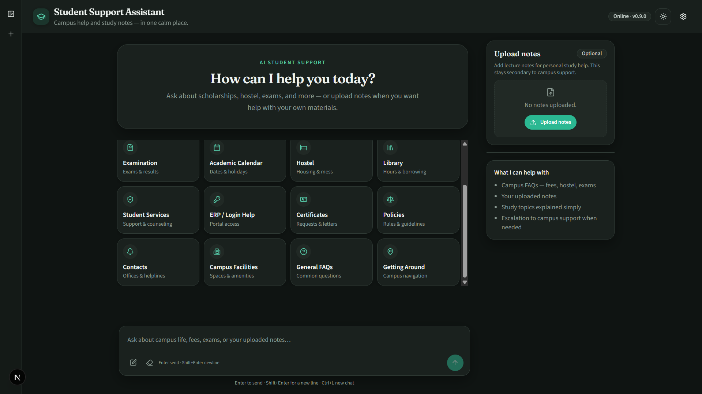
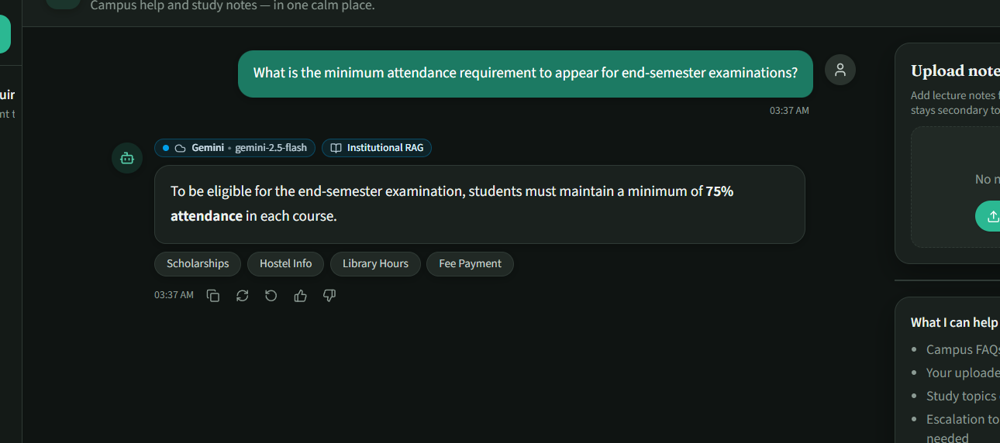
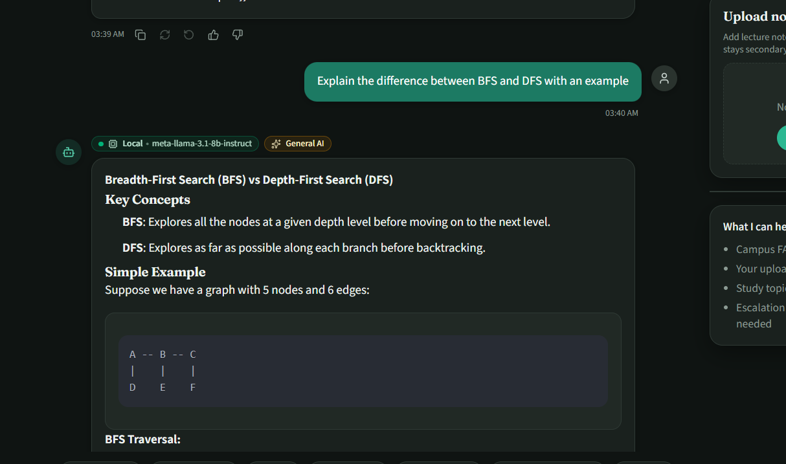
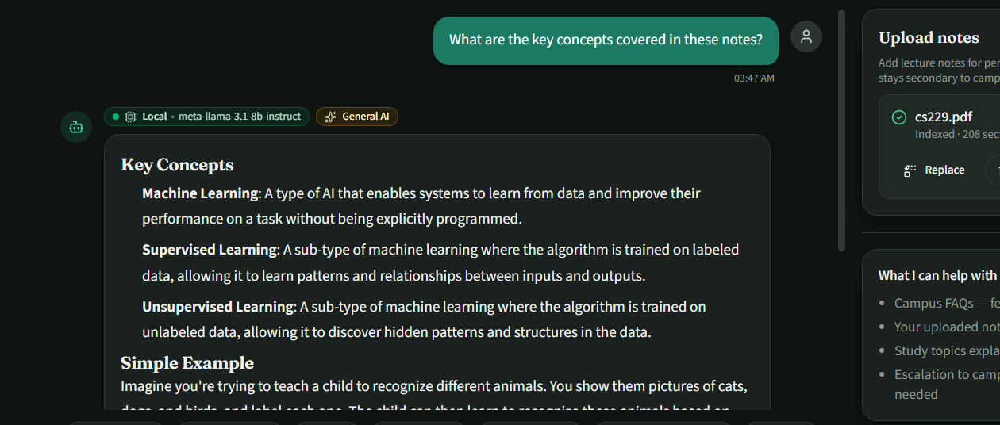
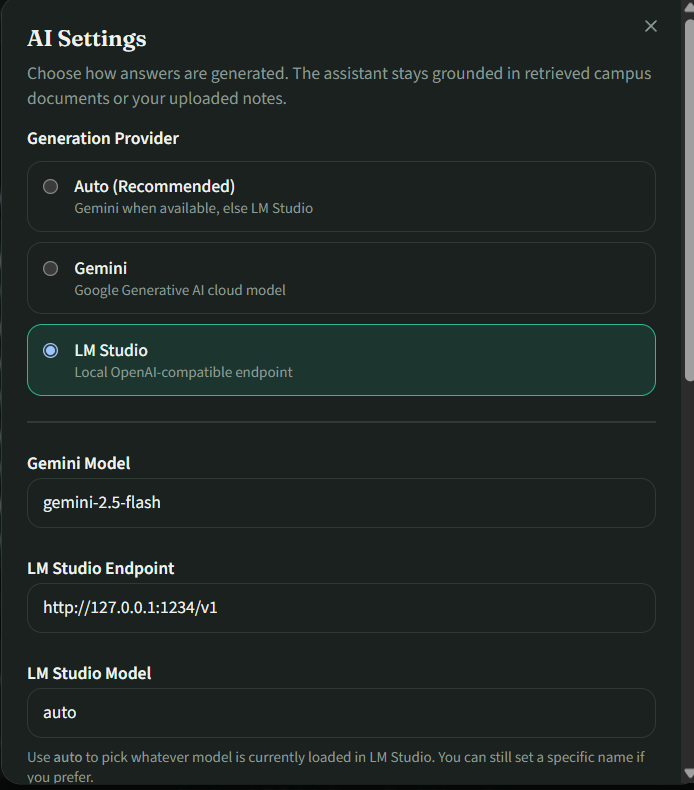
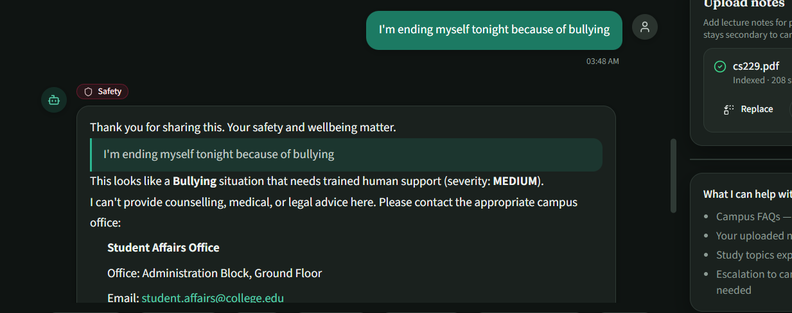
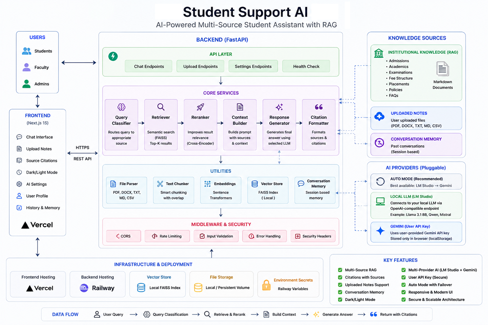

# Student Support Services AI Chatbot

A production-oriented **hybrid RAG** student support assistant for campus life and academics.

It answers institutional questions from a curated knowledge base, explains uploaded student notes, handles educational follow-ups with conversation memory, and safely escalates sensitive requests — with a modern Next.js chat UI and a FastAPI backend.

Built for academic evaluation, recruiter review, and real local demonstration (Gemini cloud or LM Studio).

---

## Features

- **Institutional RAG** — grounded answers from campus FAQs and policies (fees, hostel, library, ERP, scholarships, and more)
- **Uploaded notes Q&A** — PDF / DOCX / TXT session knowledge base with citations
- **General educational AI** — tutor-style answers when campus documents are not required
- **Multi-turn memory** — follow-ups like “give an example” or “what is the fine?” stay on topic
- **Intent routing** — institutional vs notes vs escalation vs out-of-scope
- **Safety layer** — blocks / escalates unsafe or sensitive requests with support resources
- **Hybrid knowledge modes** — grounded RAG, general AI, or honest “no official information”
- **Dual LLM providers** — Google Gemini or local LM Studio (OpenAI-compatible)
- **Streaming chat** — token streaming for responsive UX
- **Light / dark theme**, model indicator, sources inspector, quick actions

---

## Screenshots

### Home



### Institutional RAG



### General AI



### Uploaded notes



### AI Settings



### Safety response



### Architecture



---

## Tech stack

| Layer | Technology |
|-------|------------|
| Frontend | Next.js 15, React 19, TypeScript, Tailwind CSS 4 |
| Backend | Python 3.11+, FastAPI, Uvicorn, Pydantic |
| Retrieval | Sentence Transformers, FAISS |
| Documents | PyPDF, python-docx |
| Generation | Google Gemini API, LM Studio (local) |
| Config | python-dotenv |

**Not used:** Streamlit, LangChain, LlamaIndex, LangGraph, CrewAI, Pinecone.

---

## Architecture overview

```
Next.js (frontend/)
    │  REST + SSE
    ▼
FastAPI (backend/app)
    │
    ▼
ChatService (orchestrator)
    ├── Conversation memory
    ├── Intent router
    ├── Safety layer → escalation / tickets
    ├── Institutional KB (persistent FAISS)
    ├── Session KB (per-upload FAISS)
    ├── Context builder + knowledge mode
    └── LLM service → Gemini | LM Studio
```

Detailed diagram: [`docs/architecture/system-architecture.md`](docs/architecture/system-architecture.md)

---

## Folder structure

```
student-support-chatbot/
├── backend/app/           # FastAPI routers, models, orchestration services
├── frontend/              # Next.js 15 App Router UI
├── src/                   # Framework-independent RAG core (chunking, embeddings, KBs)
├── config/                # Centralized settings
├── data/knowledge_base/   # Institutional Markdown sources
├── indexes/               # Persistent FAISS artifacts (generated, gitignored)
├── uploads/               # Runtime uploads (gitignored)
├── analytics/             # Runtime analytics DB (gitignored)
├── logs/                  # Application logs (gitignored)
├── scripts/               # Bootstrap / utility scripts
├── docs/
│   ├── screenshots/       # UI captures for README
│   └── architecture/      # System design docs
├── assets/                # Optional static assets for GitHub
├── .env.example           # Backend environment template
├── requirements.txt
├── LICENSE
└── README.md
```

---

## Installation

### Prerequisites

- Python **3.11+**
- Node.js **18+** (20+ recommended)
- (Optional) [LM Studio](https://lmstudio.ai/) for local models
- (Optional) Google AI Studio API key for Gemini

### 1. Clone the repository

```bash
git clone <your-repo-url>
cd student-support-chatbot
```

### 2. Backend setup

```bash
python -m venv .venv

# Windows
.venv\Scripts\activate

# macOS / Linux
source .venv/bin/activate

pip install -r requirements.txt
copy .env.example .env          # Windows
# cp .env.example .env          # macOS / Linux
```

Edit `.env` and set at least `GOOGLE_API_KEY` if you use Gemini.

### 3. Frontend setup

```bash
cd frontend
copy .env.example .env.local    # Windows
# cp .env.example .env.local    # macOS / Linux
npm install
```

---

## Environment variables

### Backend (`.env`)

| Variable | Purpose | Default / example |
|----------|---------|-------------------|
| `LLM_PROVIDER` | `auto` \| `gemini` \| `lmstudio` | `auto` |
| `GEMINI_MODEL` | Gemini model id | `gemini-2.5-flash` |
| `GOOGLE_API_KEY` | Optional **server** Gemini fallback only | *(empty for public deploys)* |
| `GEMINI_ALLOW_SERVER_FALLBACK` | Allow server key when user has none | `true` |
| `LM_STUDIO_ENDPOINT` | OpenAI-compatible base URL (`…/v1`) — LAN, tunnel, or HTTPS | *(empty — set explicitly)* |
| `LM_STUDIO_MODEL` | Model id or `auto` | `auto` |
| `LM_STUDIO_API_KEY` | Optional bearer for authenticated remote endpoints | *(empty)* |
| `LM_STUDIO_TIMEOUT_SECONDS` | Generation request timeout | `120` |
| `LM_STUDIO_HEALTH_TIMEOUT_SECONDS` | Health probe timeout | `8` |
| `LM_STUDIO_MAX_RETRIES` | Retries on transient network / 5xx | `2` |
| `LM_STUDIO_HEALTH_INTERVAL_SECONDS` | Background health poll interval | `30` |
| `CORS_ORIGINS` | Comma-separated frontend origins | local Next.js (dev) |
| `EMBEDDING_MODEL` | Sentence Transformers model | `all-MiniLM-L6-v2` |
| `TOP_K` | Retrieval top-k | `5` |
| `SIMILARITY_THRESHOLD` | Min similarity score | `0.35` |
| `MAX_CONTEXT_CHUNKS` | Context builder chunk cap | `5` |
| `MAX_CONTEXT_CHARACTERS` | Context character budget | `6000` |
| `MAX_HISTORY_MESSAGES` | Multi-turn memory window | `8` |
| `MEMORY_IDLE_SECONDS` | Clear memory after idle | `7200` |
| `FAISS_INDEX_PATH` | Institutional index dir | `indexes` |
| `UPLOAD_FOLDER` | Upload directory | `uploads` |
| `SQLITE_DB_PATH` | Analytics DB path | `analytics/analytics.db` |
| `LOG_LEVEL` | Logging level | `INFO` |

Legacy aliases still work: `LMSTUDIO_BASE_URL`, `LMSTUDIO_MODEL`, `LMSTUDIO_API_KEY`.

User Gemini keys are **not** environment variables. Visitors enter them in AI Settings; they stay in the browser (`localStorage` key `gemini_api_key`) and are sent only with chat requests.

Full template: [`.env.example`](.env.example)

### Frontend (`frontend/.env.local`)

| Variable | Purpose |
|----------|---------|
| `NEXT_PUBLIC_API_BASE_URL` | FastAPI base URL (e.g. `http://127.0.0.1:8000`) |

Template: [`frontend/.env.example`](frontend/.env.example)

---

## Running locally

### Backend

```bash
# from project root, with venv activated
uvicorn backend.app.main:app --reload --port 8000
```

- API: http://127.0.0.1:8000  
- Interactive docs: http://127.0.0.1:8000/docs  

On first start, the institutional FAISS index is built or loaded from `data/knowledge_base/`.

### Frontend

```bash
cd frontend
npm run dev
```

Open http://localhost:3000

### Quick helper

```bash
python app.py
```

Prints the same start commands.

---

## API overview

| Method | Path | Purpose |
|--------|------|---------|
| `GET` | `/` | Service probe |
| `GET` | `/health` | Health, embedding model, index status |
| `POST` | `/chat` | Full chat turn |
| `POST` | `/chat/stream` | SSE streaming chat |
| `GET` / `POST` | `/conversations` | List / create conversations |
| `GET` / `DELETE` | `/conversations/{id}` | Load / delete conversation |
| `POST` | `/conversations/{id}/clear` | Clear messages |
| `POST` | `/session` | Create notes session → `{ session_id }` |
| `DELETE` | `/session/{session_id}` | Clear session KB |
| `POST` | `/upload` | Upload file into session KB (`multipart`) |
| `POST` | `/search/institutional` | Institutional retrieval (debug / tools) |
| `POST` | `/search/session` | Session retrieval (debug / tools) |
| `GET` / `PUT` | `/settings/llm` | Read / update LLM settings |
| `GET` | `/settings/llm/health` | LM Studio online/offline (cached) + fallback flags |
| `GET` | `/api/providers/status` | Cached provider health (`?refresh=true` to re-probe) |
| `POST` | `/settings/llm/validate-gemini` | Validate a user Gemini key (never stored) |
| `POST` | `/settings/llm/test` | Provider connectivity test |

OpenAPI schema: http://127.0.0.1:8000/docs

---

## AI Providers

The chatbot uses a modular multi-provider stack under `backend/app/services/llm/`.

### Remote LM Studio architecture

Deployed demos reach **your** laptop without redesigning the app:

```
Mentor / user
    │
    ▼
Vercel (Next.js frontend)
    │
    ▼
Railway (FastAPI backend)
    │  ProviderFactory
    ▼
LM_STUDIO_ENDPOINT  (HTTPS tunnel / LAN / public URL …/v1)
    │  optional Authorization: Bearer <LM_STUDIO_API_KEY>
    ▼
Your laptop → LM Studio (OpenAI-compatible server)
```

The backend never hardcodes a loopback address for LM Studio. Configure the
endpoint via `LM_STUDIO_ENDPOINT` (Railway env) and/or AI Settings.

### Provider flow

```
User (browser)
    │  chat + optional gemini_api_key (localStorage only)
    ▼
Next.js Frontend
    │
    ▼
FastAPI Backend
    │  ProviderFactory (central selection)
    ├──────────────┬──────────────────┐
    ▼              ▼                  ▼
Remote LM      Gemini (user key)   Gemini (optional server)
Studio         from request        GOOGLE_API_KEY
(configured    — never stored
 endpoint)
```

### Auto mode

Automatically selects the best available provider:

1. **Remote LM Studio** — if cached health shows the endpoint online (`GET {endpoint}/models`)  
2. **User Gemini API key** — from the chat request (browser `localStorage`)  
3. **Optional server Gemini key** — only if `GEMINI_ALLOW_SERVER_FALLBACK=true` and `GOOGLE_API_KEY` is set  
4. Otherwise: **No AI provider available.**

If remote LM Studio goes offline while in **Auto**, the next turn falls through to Gemini without crashing. Explicit **LM Studio** mode never silently switches providers.

### LM Studio (local, LAN, or remote)

- Endpoint is fully configurable in AI Settings / `LM_STUDIO_ENDPOINT`.
- Accepts local, LAN (`http://192.168.x.x:1234/v1`), or public HTTPS tunnel URLs.
- Supports any OpenAI-compatible server: LM Studio, Ollama, vLLM, LocalAI.
- Optional `LM_STUDIO_API_KEY` adds `Authorization: Bearer …` on every LM request (never returned to the frontend or logged).
- Background health monitor caches Online/Offline; exposed at `GET /api/providers/status`.
- When LM Studio is selected explicitly and the endpoint is offline, the UI reports **Local AI server is currently offline** (no silent Gemini fallback).

### Cloudflare Tunnel example

Expose LM Studio’s OpenAI server (default port `1234`) over HTTPS without opening inbound firewall ports:

```bash
# 1. In LM Studio: start the local server (OpenAI-compatible, /v1)

# 2. Install cloudflared, then create a quick tunnel to the LM Studio port:
cloudflared tunnel --url http://127.0.0.1:1234

# 3. Copy the https://….trycloudflare.com URL and set on Railway:
LM_STUDIO_ENDPOINT=https://YOUR-SUBDOMAIN.trycloudflare.com/v1
# Optional shared secret for your reverse proxy / Access policy:
LM_STUDIO_API_KEY=your-secret-token
```

For a stable hostname, create a named Cloudflare Tunnel and point it at `http://127.0.0.1:1234`, then set `LM_STUDIO_ENDPOINT=https://lm.yourdomain.com/v1`.

You can also paste the same HTTPS URL into **AI Settings → LM Studio Endpoint** (UI unchanged).

### Gemini

- Visitors paste **their own** API key in AI Settings.
- Stored only as `localStorage.gemini_api_key` in their browser.
- Sent with `/chat` and `/chat/stream` as `api_key` for that request only.
- Never written to the database, cookies, logs, or analytics.
- Validate via `POST /settings/llm/validate-gemini` before saving.

### Security

- Server Gemini keys are never returned to the frontend.
- User keys use Pydantic `SecretStr` and request-scoped context — never persisted.
- `LM_STUDIO_API_KEY` and Authorization headers are never logged or exposed via API.
- Prefer leaving `GOOGLE_API_KEY` empty on public deployments so the product does not depend on an operator’s personal key.
- Prefer HTTPS tunnels + bearer auth for any internet-reachable LM Studio endpoint.

### Provider selection flow (summary)

| Mode | Behavior |
|------|----------|
| Auto | Remote LM online → else user Gemini → else server Gemini → else error |
| Gemini | User key → else server fallback → else “No Gemini API key configured.” |
| LM Studio | Online → generate; Offline → “Local AI server is currently offline.” |

---

## RAG pipeline explanation

1. **Ingest** — Institutional Markdown under `data/knowledge_base/` is chunked and embedded into a persistent FAISS index (`indexes/`).
2. **Session ingest** — Uploaded notes are parsed, chunked, and indexed in an in-memory Session KB keyed by `session_id`.
3. **Route** — The intent router classifies the user message (optionally expanded for follow-ups via conversation memory).
4. **Safety** — Unsafe or escalate-intent traffic never reaches generation; tickets / support resources are returned instead.
5. **Retrieve** — Top-k similar chunks are fetched from the Institutional or Session KB.
6. **Context build** — Chunks are filtered by similarity and packed under a character budget.
7. **Knowledge mode** — Decides grounded RAG vs general educational AI vs insufficient-official-info messaging.
8. **Generate** — Gemini or LM Studio produces Markdown answers; grounded answers include citation metadata for the UI.

```
Query → Memory expand → Intent → Safety → Retrieve → Context → Mode → LLM → Format → UI
```

---

## Project workflow

Typical demo flow:

1. Start FastAPI and Next.js.
2. Ask an institutional question (e.g. hostel fees, library fine).
3. Ask a follow-up (“When is the deadline?”) — memory keeps context.
4. Upload notes → ask chapter / MCQ questions.
5. Ask a general academic question (e.g. explain recursion).
6. Open **Sources** / **AI Inspector** on grounded replies.
7. Switch provider in **AI Settings** if LM Studio is running locally.

Optional KB bootstrap script:

```bash
python scripts/bootstrap_knowledge_base.py
```

---

## Future improvements

- Persistent conversation store (SQLite / Postgres) instead of in-memory
- Richer analytics dashboards for usage and escalation tickets
- Admin UI for editing institutional documents and re-indexing
- Evaluation harness (retrieval + answer quality metrics)
- Auth / role-aware answers (student vs faculty)
- Deployment recipes (Docker Compose, cloud hosting)

---

## License

This project is released under the [MIT License](LICENSE).

---

## Author

**Akshay**

Academic / portfolio project — hybrid RAG student support chatbot (FastAPI + Next.js).

If you are reviewing this repository for hiring or course evaluation: start the stack locally, try the institutional and notes flows, and inspect `/docs` for the live API contract.
